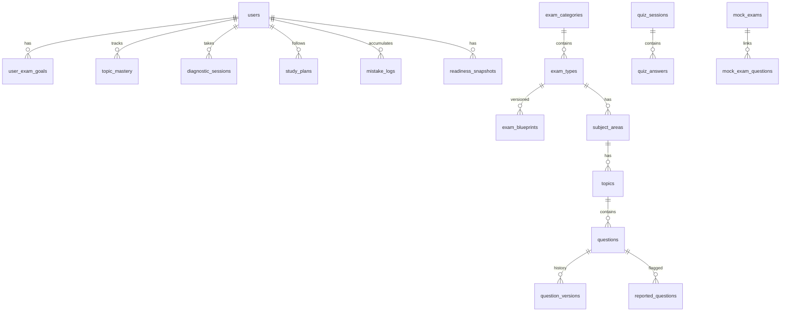

# ReviewNatin MVP Database Schema

Revised schema per audit: merged study plans, embedded choices, blueprint versioning, content governance, and analytics primitives.

**Stack recommendation:** PostgreSQL (Supabase) with Row Level Security.

---

## Entity relationship overview



---

## Core catalog

### `exam_categories`

| Column | Type | Notes |
|--------|------|-------|
| id | uuid PK | |
| slug | text UNIQUE | `prc`, `civil-service`, `college-entrance` (Phase 1: only `civil-service`, `prc`) |
| name | text | Display name |
| sort_order | int | |
| is_active | boolean | Phase 1: filter inactive |

### `exam_types`

| Column | Type | Notes |
|--------|------|-------|
| id | uuid PK | |
| category_id | uuid FK | |
| slug | text UNIQUE | `cse-professional`, `let-elementary`, `pnle` |
| name | text | |
| description | text | |
| official_registration_url | text | CSC or PRC link |
| is_active | boolean | |
| phase | int | `1` for MVP |

### `exam_blueprints`

Versioned TOS alignment — **required before bulk question import**.

| Column | Type | Notes |
|--------|------|-------|
| id | uuid PK | |
| exam_type_id | uuid FK | |
| version | text | Semver: `1.0.0` |
| effective_date | date | |
| topic_weights | jsonb | Subject/topic distribution per [01-phase-1-exam-blueprints.md](./01-phase-1-exam-blueprints.md) |
| mock_exam_config | jsonb | Item count, timers, part structure |
| content_targets | jsonb | Min questions per subject for QA |
| official_source_url | text | |
| created_at | timestamptz | |

**Unique:** `(exam_type_id, version)`

### `subject_areas`

| Column | Type | Notes |
|--------|------|-------|
| id | uuid PK | |
| exam_type_id | uuid FK | |
| slug | text | `verbal`, `prof-ed`, `np1-community` |
| name | text | |
| weight_percent | numeric(5,2) | From blueprint |
| sort_order | int | |

**Unique:** `(exam_type_id, slug)`

### `topics`

| Column | Type | Notes |
|--------|------|-------|
| id | uuid PK | |
| subject_area_id | uuid FK | |
| slug | text | |
| name | text | |
| description | text | |
| sort_order | int | |
| blueprint_topic_code | text | Optional TOS code |

**Unique:** `(subject_area_id, slug)`

---

## Content governance

### `questions`

MVP: embed choices in JSONB; normalize to `choices` table when bank exceeds 10k.

| Column | Type | Notes |
|--------|------|-------|
| id | uuid PK | |
| topic_id | uuid FK | |
| blueprint_id | uuid FK | Links to `exam_blueprints` used at creation |
| stem | text | Question text (supports LaTeX) |
| choices | jsonb | `[{ "id": "a", "text": "..." }, ...]` |
| correct_choice_id | text | `a`, `b`, `c`, `d` |
| explanation_en | text | |
| explanation_fil | text | Taglish-friendly |
| difficulty | smallint | 1–5 |
| status | enum | `draft`, `in_review`, `published`, `archived` |
| source | text | `original`, `adapted`, `pyq-inspired` |
| source_note | text | "Based on CSC exam coverage guidelines" |
| reviewed_by | uuid FK → users | Admin reviewer |
| reviewed_at | timestamptz | |
| is_verified | boolean | Human-reviewed badge |
| tags | text[] | Competency tags (PNLE), Bloom level |
| created_at | timestamptz | |
| updated_at | timestamptz | |

**Removed from original spec:** separate `Choice` table (defer), `AIReviewPlan` (merged into `study_plans`).

### `question_versions`

Immutable history when published questions are edited.

| Column | Type | Notes |
|--------|------|-------|
| id | uuid PK | |
| question_id | uuid FK | |
| version_number | int | |
| snapshot | jsonb | Full question payload at publish time |
| change_reason | text | |
| created_by | uuid FK | |
| created_at | timestamptz | |

### `reported_questions`

User-facing "Report wrong answer" flow.

| Column | Type | Notes |
|--------|------|-------|
| id | uuid PK | |
| question_id | uuid FK | |
| user_id | uuid FK | |
| reason | enum | `wrong_answer`, `unclear_question`, `outdated`, `other` |
| details | text | |
| status | enum | `open`, `triaged`, `fixed`, `rejected` |
| resolved_by | uuid FK | |
| resolved_at | timestamptz | |
| created_at | timestamptz | |

### `content_changelog`

Monthly visible updates for users.

| Column | Type | Notes |
|--------|------|-------|
| id | uuid PK | |
| title | text | "Added 120 LET Prof Ed items" |
| body | text | |
| exam_type_id | uuid FK nullable | |
| published_at | timestamptz | |

---

## Users and goals

### `users`

| Column | Type | Notes |
|--------|------|-------|
| id | uuid PK | Supabase auth uid |
| email | text | |
| display_name | text | |
| role | enum | `student`, `admin`, `content_reviewer` |
| locale | text | `en`, `fil`, `taglish` |
| streak_count | int | Current streak |
| streak_last_date | date | |
| created_at | timestamptz | |

**Deferred:** optional mobile number (SMS OTP cost).

### `user_exam_goals`

Replaces scattered onboarding fields — drives PasaPath and countdown.

| Column | Type | Notes |
|--------|------|-------|
| id | uuid PK | |
| user_id | uuid FK | |
| exam_type_id | uuid FK | Primary target exam |
| target_exam_date | date | |
| daily_minutes | smallint | 15, 30, 45, 60 |
| current_level | enum | `beginner`, `average`, `advanced` |
| major_slug | text nullable | LET Secondary only |
| onboarding_completed_at | timestamptz | |
| is_active | boolean | User can switch exam |

---

## Learning analytics

### `diagnostic_sessions`

Day 0 baseline — required before PasaPath.

| Column | Type | Notes |
|--------|------|-------|
| id | uuid PK | |
| user_id | uuid FK | |
| exam_type_id | uuid FK | |
| item_count | int | ~30–50 |
| score_percent | numeric(5,2) | |
| score_by_topic | jsonb | `{ "topic_id": { "correct": 4, "total": 5 } }` |
| duration_seconds | int | |
| completed_at | timestamptz | |

### `topic_mastery`

Powers weakness detector, PasaPath 60% allocation, readiness score.

| Column | Type | Notes |
|--------|------|-------|
| id | uuid PK | |
| user_id | uuid FK | |
| topic_id | uuid FK | |
| accuracy | numeric(5,2) | Rolling 30-day |
| attempts | int | |
| correct_count | int | |
| last_seen_at | timestamptz | |
| next_review_at | timestamptz | SM-2 spaced repetition |
| ease_factor | numeric(4,2) default 2.5 | |
| interval_days | int default 1 | |

**Unique:** `(user_id, topic_id)`

### `readiness_snapshots`

Transparent "Confidence Score" — computed daily.

| Column | Type | Notes |
|--------|------|-------|
| id | uuid PK | |
| user_id | uuid FK | |
| exam_type_id | uuid FK | |
| score_0_100 | smallint | |
| factors | jsonb | See [03-pasapath-spec.md](./03-pasapath-spec.md) |
| computed_at | timestamptz | |

### `study_plans`

**Merged `AIReviewPlan` + `StudyPlan`.**

| Column | Type | Notes |
|--------|------|-------|
| id | uuid PK | |
| user_id | uuid FK | |
| exam_type_id | uuid FK | |
| source | enum | `template`, `ai_generated`, `pasapath_engine` |
| target_date | date | |
| daily_minutes | smallint | |
| plan_json | jsonb | Daily task list generated by PasaPath |
| generated_at | timestamptz | |
| is_active | boolean | |

---

## Quiz and mock exam

### `quiz_sessions`

| Column | Type | Notes |
|--------|------|-------|
| id | uuid PK | |
| user_id | uuid FK | |
| exam_type_id | uuid FK | |
| mode | enum | `practice`, `timed`, `mock`, `diagnostic`, `mistake_review` |
| mock_exam_id | uuid FK nullable | |
| item_count | int | |
| score_percent | numeric(5,2) | |
| duration_seconds | int | |
| started_at | timestamptz | |
| completed_at | timestamptz | |

### `quiz_answers`

| Column | Type | Notes |
|--------|------|-------|
| id | uuid PK | |
| session_id | uuid FK | |
| question_id | uuid FK | |
| selected_choice_id | text | |
| is_correct | boolean | |
| time_spent_seconds | int | |
| answered_at | timestamptz | |

### `mock_exams`

| Column | Type | Notes |
|--------|------|-------|
| id | uuid PK | |
| exam_type_id | uuid FK | |
| blueprint_id | uuid FK | |
| title | text | "CSE Pro Mock 1" |
| item_count | int | |
| duration_seconds | int | |
| is_active | boolean | |

### `mock_exam_questions`

| Column | Type | Notes |
|--------|------|-------|
| mock_exam_id | uuid FK | |
| question_id | uuid FK | |
| sort_order | int | |

**PK:** `(mock_exam_id, question_id)`

### `mistake_logs`

| Column | Type | Notes |
|--------|------|-------|
| id | uuid PK | |
| user_id | uuid FK | |
| question_id | uuid FK | |
| wrong_choice_id | text | |
| times_wrong | int | |
| last_wrong_at | timestamptz | |
| mastered_at | timestamptz nullable | Set when answered correctly 2x in mistake review |
| next_review_at | timestamptz | |

**Unique:** `(user_id, question_id)`

---

## Supplementary content

### `review_materials`

| Column | Type | Notes |
|--------|------|-------|
| id | uuid PK | |
| topic_id | uuid FK | |
| title | text | |
| body | text | Markdown |
| material_type | enum | `lesson`, `formula`, `note` |
| is_premium | boolean | |
| offline_pack_id | text nullable | |

### `flashcards`

| Column | Type | Notes |
|--------|------|-------|
| id | uuid PK | |
| topic_id | uuid FK | |
| front | text | |
| back | text | |
| is_premium | boolean | |

### `bookmarks`

| Column | Type | Notes |
|--------|------|-------|
| user_id | uuid FK | |
| question_id | uuid FK nullable | |
| review_material_id | uuid FK nullable | |
| created_at | timestamptz | |

### `exam_schedules`

Curated official dates — read-only in MVP.

| Column | Type | Notes |
|--------|------|-------|
| id | uuid PK | |
| exam_type_id | uuid FK | |
| event_type | enum | `application_open`, `application_close`, `exam_date`, `results_release` |
| event_date | date | |
| source_url | text | |
| notes | text | |

### `announcements`

| Column | Type | Notes |
|--------|------|-------|
| id | uuid PK | |
| title | text | |
| body | text | |
| exam_type_id | uuid FK nullable | |
| published_at | timestamptz | |

---

## Monetization (simplified tiers)

### `subscription_products`

Maps to Apple/Google IAP SKUs — see [05-pricing-iap.md](./05-pricing-iap.md).

| Column | Type | Notes |
|--------|------|-------|
| id | uuid PK | |
| sku | text UNIQUE | `exam_pass_cse_pro`, `plus_monthly`, `plus_yearly` |
| tier | enum | `free`, `exam_pass`, `plus` |
| exam_type_id | uuid FK nullable | Null for Plus all-access |
| price_php | int | Display reference |
| duration_days | int nullable | 180 for exam pass |
| store | enum | `apple`, `google`, `both` |

### `user_entitlements`

| Column | Type | Notes |
|--------|------|-------|
| id | uuid PK | |
| user_id | uuid FK | |
| product_id | uuid FK | |
| exam_type_id | uuid FK nullable | |
| expires_at | timestamptz nullable | |
| source | enum | `iap`, `promo`, `admin` |
| transaction_id | text | Store receipt reference |

### `payment_transactions`

| Column | Type | Notes |
|--------|------|-------|
| id | uuid PK | |
| user_id | uuid FK | |
| product_id | uuid FK | |
| amount_php | int | |
| provider | enum | `apple`, `google` |
| status | enum | `pending`, `completed`, `refunded` |
| raw_receipt | jsonb | |
| created_at | timestamptz | |

**Deferred:** GCash/Maya direct (web checkout Phase 2).

---

## Gamification (minimal MVP)

### `achievement_badges`

| Column | Type | Notes |
|--------|------|-------|
| id | uuid PK | |
| slug | text | `streak_7`, `mock_complete_1` |
| name | text | |
| criteria | jsonb | |

### `user_badges`

| Column | Type | Notes |
|--------|------|-------|
| user_id | uuid FK | |
| badge_id | uuid FK | |
| earned_at | timestamptz | |

**Deferred:** `leaderboard` tables (Phase 2).

---

## Admin audit

### `admin_logs`

| Column | Type | Notes |
|--------|------|-------|
| id | uuid PK | |
| admin_id | uuid FK | |
| action | text | `question.publish`, `report.resolve` |
| entity_type | text | |
| entity_id | uuid | |
| metadata | jsonb | |
| created_at | timestamptz | |

---

## Removed / deferred from original spec

| Original | Decision |
|----------|----------|
| `choices` table | Embedded JSONB in MVP |
| `AIReviewPlan` | Merged into `study_plans` |
| `SubscriptionPlan` (4 tiers) | Reduced to 3: Free, Exam Pass, Plus |
| `roles` table | Enum on `users.role` for MVP |
| Leaderboard | Phase 2 |
| Review Center bulk | Phase 2 B2B |

---

## Indexes (recommended)

```sql
CREATE INDEX idx_questions_topic_status ON questions(topic_id, status) WHERE status = 'published';
CREATE INDEX idx_topic_mastery_user_next ON topic_mastery(user_id, next_review_at);
CREATE INDEX idx_mistake_logs_user_review ON mistake_logs(user_id, next_review_at) WHERE mastered_at IS NULL;
CREATE INDEX idx_quiz_sessions_user_exam ON quiz_sessions(user_id, exam_type_id, completed_at DESC);
```
