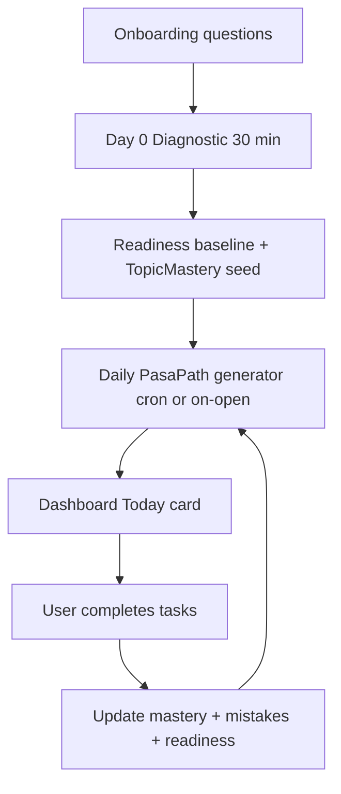

# PasaPath Engine Specification (MVP)

PasaPath is ReviewNatin's **hero feature** — a day-by-day study path from diagnostic to exam day. It replaces separate "AI Study Plan" and "Study Plan" features with one visible dashboard product.

**Tagline on dashboard:** `106 days left · 68% ready · Today's PasaPath: 20 min`

---

## Goals

1. Turn onboarding answers + diagnostic into a **daily actionable task list**
2. Allocate study time: **60% weak topics**, **25% spaced review**, **15% new blueprint topics**
3. Respect `daily_minutes` cap from `user_exam_goals`
4. Feed **readiness score** with transparent factors
5. Connect to **Mistake Bank** automatically

---

## User journey



---

## Day 0: Diagnostic

Triggered when `user_exam_goals.onboarding_completed_at` is set and no `diagnostic_sessions` exist for active exam.

| Parameter | Value |
|-----------|-------|
| Item count | 40 (balanced across top subject areas per blueprint weights) |
| Mode | `diagnostic` |
| Timer | Soft limit 30 minutes (warn, do not auto-submit) |
| Hints | Disabled |
| Explanations | Shown after each item (learning mode) |

### Post-diagnostic actions

1. Insert `diagnostic_sessions` with `score_by_topic`
2. Initialize `topic_mastery` for each topic touched (accuracy from diagnostic)
3. Create first `readiness_snapshots` (baseline, typically 15–35%)
4. Generate first `study_plans` row (`source: pasapath_engine`)
5. Show results screen: top 3 weak subjects + "Your PasaPath starts tomorrow"

---

## Daily plan generation

Run when:
- User opens app after local midnight (timezone: `Asia/Manila` default)
- User completes all tasks from previous day (optional early regen)
- Admin triggers regen (support)

**Function:** `generatePasaPath(userId, examTypeId, date)`

### Inputs

| Input | Source |
|-------|--------|
| `daily_minutes` | `user_exam_goals` |
| `days_until_exam` | `target_exam_date - today` |
| `topic_mastery` | accuracy, `next_review_at`, attempts |
| `mistake_logs` | `mastered_at IS NULL`, ordered by `times_wrong DESC` |
| `blueprint` | Active `exam_blueprints` for exam type |
| `completed_topics` | Topics with accuracy ≥ 80% and attempts ≥ 10 |

### Time budget split

| Bucket | % of minutes | Activity types |
|--------|--------------|----------------|
| Weak topics | 60% | Practice quiz (10–15 items) on lowest-accuracy topics |
| Spaced review | 25% | Mistake Bank items due + flashcards with `next_review_at <= today` |
| New topics | 15% | Next unread topic in blueprint order (lesson skim + 5 practice items) |

### Question count heuristic

Assume **~1.5 minutes per question** (read + answer + explanation).

```
max_questions = floor(daily_minutes / 1.5)
weak_count    = floor(max_questions * 0.60)
review_count  = floor(max_questions * 0.25)
new_count     = max_questions - weak_count - review_count
```

Example: 30 min/day → ~20 questions → 12 weak + 5 review + 3 new.

### Weak topic selection

1. Rank topics by `accuracy ASC`, `attempts DESC` (prioritize attempted but weak)
2. Exclude topics mastered (accuracy ≥ 80%, attempts ≥ 10)
3. Pick top 1–2 topics for today's weak block
4. If fewer than 5 mistakes exist, fill with related topics in same `subject_area`

### Spaced review selection

1. Pull `mistake_logs` where `next_review_at <= today` AND `mastered_at IS NULL` (limit `review_count`)
2. Pull flashcards linked to weak topics with SM-2 due date
3. If under quota, pull `topic_mastery` rows where `next_review_at <= today`

### New topic selection

1. Walk `topics` in `sort_order` within blueprint
2. Skip topics with any `topic_mastery.attempts > 0`
3. Assign next topic: optional `review_materials` read (5 min) + `new_count` practice questions

### Output: `study_plans.plan_json`

```json
{
  "date": "2026-05-23",
  "days_until_exam": 106,
  "estimated_minutes": 30,
  "tasks": [
    {
      "id": "task-1",
      "type": "practice",
      "title": "Numerical Ability — Word Problems",
      "topic_ids": ["uuid-1"],
      "item_count": 12,
      "estimated_minutes": 18,
      "priority": "weak",
      "completed": false
    },
    {
      "id": "task-2",
      "type": "mistake_review",
      "title": "Mistake Bank (5 items)",
      "item_count": 5,
      "estimated_minutes": 8,
      "priority": "review",
      "completed": false
    },
    {
      "id": "task-3",
      "type": "lesson",
      "title": "Read: Analytical Ability — Logic basics",
      "review_material_id": "uuid-2",
      "estimated_minutes": 5,
      "priority": "new",
      "completed": false
    }
  ]
}
```

---

## Task completion rules

| Task type | Marks complete when |
|-----------|---------------------|
| `practice` | `quiz_sessions` completed with matching `topic_ids` and `item_count` |
| `mistake_review` | Mistake review session finished |
| `mock` | Weekly mock task — full mock submitted (Board Exam Mode) |
| `lesson` | User taps "Done reading" or spends ≥ 80% estimated read time |
| `flashcards` | All due cards reviewed |

**Streak:** Increment if ≥ 1 task completed per calendar day (Manila TZ).

---

## Weekly rhythm (injected into plan)

| Day offset mod 7 | Extra task |
|------------------|------------|
| 0 (Sunday) | Optional light review only |
| 3 (Wednesday) | Mini-mock: 20 items timed (free tier: 1/week) |
| 6 (Saturday) | Full mock exam if premium; else mini-mock |

Adjust intensity when `days_until_exam < 14`: increase mock frequency to 2/week, reduce new topics to 5%.

---

## Readiness score (Confidence Score)

Computed in `computeReadiness(userId, examTypeId)` — stored in `readiness_snapshots`.

### Formula (MVP)

```
readiness = clamp(0, 100,
  0.40 * mock_score_avg +
  0.30 * topic_coverage_pct +
  0.20 * mistake_mastery_pct +
  0.10 * diagnostic_trend
)
```

| Factor | Calculation |
|--------|-------------|
| `mock_score_avg` | Average of last 3 mock `quiz_sessions.score_percent` (0 if none) |
| `topic_coverage_pct` | % of blueprint topics with `topic_mastery.accuracy >= 70` and `attempts >= 5` |
| `mistake_mastery_pct` | `1 - (open_mistakes / total_mistakes)` capped, min 0 |
| `diagnostic_trend` | `(latest_practice_avg - diagnostic_score) * 2` capped 0–100 |

### Display bands

| Score | Label | Copy |
|-------|-------|------|
| 0–39 | Needs foundation | "Focus on basics — PasaPath will prioritize weak areas." |
| 40–69 | Improving | "Good progress — keep your daily streak." |
| 70–84 | Almost ready | "Strong coverage — take a full mock this week." |
| 85–100 | Exam-ready | "You're in great shape — maintain with mocks." |

**UI requirement:** Tap readiness % to see factor breakdown (transparent methodology).

---

## Weakness detector (post-quiz)

After every `practice`, `timed`, or `mock` session:

1. Update `topic_mastery` per topic in session
2. Insert/update `mistake_logs` for wrong answers
3. Show immediate card: **"You are strong in X but weak in Y"** with 1-tap "Add to tomorrow's PasaPath" (already automatic)
4. Suggest 3 related topics from same subject

---

## Spaced repetition (SM-2 simplified)

On mistake review or flashcard review:

| Result | Action |
|--------|--------|
| Correct | Increase `interval_days` × `ease_factor`, set `next_review_at` |
| Wrong | Reset `interval_days = 1`, decrease `ease_factor` min 1.3, re-queue in Mistake Bank |

When user answers same mistake correctly **twice** in mistake review mode → set `mistake_logs.mastered_at`.

---

## Board Exam Mode integration

Weekly mock tasks use:

- `allow_back_navigation: false`
- `show_hints: false`
- Strict timer from `exam_blueprints.mock_exam_config`
- No ads (all tiers during mock)

---

## AI usage (MVP scope)

| Feature | MVP | Phase 2 |
|---------|-----|---------|
| PasaPath task list | Rule-based engine (this spec) | Optional AI reorder |
| Taglish explanation | Cached templates + optional AI gen per question | Full AI tutor chat |
| Study plan copy | Template strings | AI-personalized messaging |

**Guardrails when AI generates explanations:**

- Server-side only; cache by `(question_id, locale)`
- Append disclaimer: "AI-generated — verify with official references"
- Token budget: 5 AI explanations/day free, unlimited Plus
- Prefer human `explanation_fil` when `is_verified = true`

---

## API endpoints (backend)

| Method | Path | Purpose |
|--------|------|---------|
| POST | `/api/v1/diagnostic/start` | Start diagnostic session |
| POST | `/api/v1/diagnostic/:id/complete` | Finalize + trigger PasaPath init |
| GET | `/api/v1/pasapath/today` | Today's plan JSON |
| POST | `/api/v1/pasapath/tasks/:id/complete` | Mark task done |
| GET | `/api/v1/readiness` | Latest snapshot + factors |
| POST | `/api/v1/readiness/compute` | Force recompute (internal/cron) |

---

## Cron jobs

| Job | Schedule | Action |
|-----|----------|--------|
| `pasapath-daily` | 00:05 Asia/Manila | Generate plans for active users |
| `readiness-daily` | 00:30 Asia/Manila | Recompute readiness snapshots |
| `streak-reset` | 00:00 Asia/Manila | Break streak if no task completed yesterday |

---

## Mobile UI: Dashboard PasaPath card

```
┌─────────────────────────────────────┐
│ PasaPath · Day 24 of 130           │
│ ████████░░░░ 68% exam-ready        │
│                                     │
│ Today's path (~30 min)              │
│ ○ Numerical — Word Problems (12)   │
│ ○ Mistake Bank (5)                  │
│ ○ New: Logic basics (lesson)        │
│                                     │
│ [Start first task]                  │
└─────────────────────────────────────┘
```

---

## Success metrics

| Metric | Target (beta) |
|--------|-----------------|
| Diagnostic completion rate | ≥ 70% of new signups |
| Daily PasaPath task completion | ≥ 40% DAU complete ≥1 task |
| D7 retention | ≥ 25% |
| Readiness score viewed | ≥ 50% of weekly actives |
