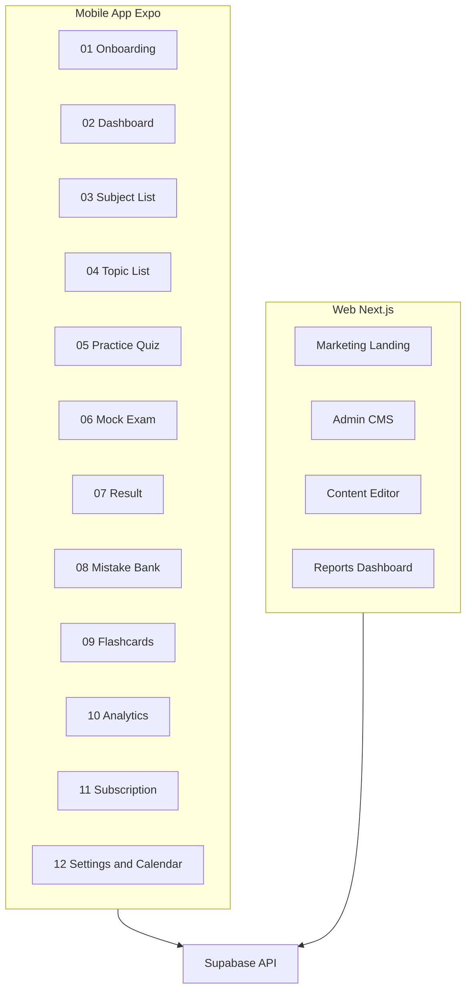

# MVP Screen Scope

Mobile v1 ships **12 screens**. Marketing landing, admin CMS, and reports are **web-only**.

**App entry:** Login or Onboarding (no marketing landing in mobile app).

---

## Platform split

---

## Mobile screens (v1)

### 01 — Onboarding + Exam Goal Setup + Diagnostic

**Route:** `/onboarding` → `/diagnostic`

**Purpose:** Day 0 flow per audit — replaces in-app landing page.

| Step | Fields / actions |
|------|------------------|
| Welcome | Brand, disclaimer, "Get started" |
| Exam selection | CSE Pro, CSE Sub, LET Elem, LET Sec (+ major picker), PNLE |
| Goal setup | Target exam date, daily minutes (15/30/45/60), current level |
| Auth | Email + Google Sign-In (Apple on iOS). **No mobile number in v1.** |
| Diagnostic intro | Explain 30-min baseline test |
| Diagnostic | 40 items, soft timer, explanations after each |

**Exit:** Dashboard with first PasaPath + baseline readiness.

**Deferred:** Choose Exam as separate screen (merged into onboarding).

---

### 02 — Dashboard

**Route:** `/` (authenticated home)

**Components:**
- Exam countdown header (`106 days before CSE Professional`)
- Readiness score ring (tappable → factor breakdown)
- Study streak flame + weekly checkmarks
- **PasaPath Today card** (primary CTA)
- Quick actions: Practice, Mock, Mistake Bank, Flashcards
- Weakness snapshot (last quiz: "Weak in Numerical — Word Problems")
- Optional: latest announcement chip

**Not in v1:** Leaderboard widget, Barkada invite, AI chat entry.

---

### 03 — Subject List

**Route:** `/study/subjects`

Lists `subject_areas` for user's active `exam_type` with progress bars (% mastery from `topic_mastery` aggregate).

**Actions:** Tap subject → Topic List.

---

### 04 — Topic List

**Route:** `/study/subjects/:subjectSlug`

Lists `topics` with:
- Mastery %
- Verified content count
- CTA: Practice, Read lesson, Flashcards

---

### 05 — Practice Quiz

**Route:** `/quiz/practice`

**Modes accessible from here:**
- Practice (untimed, instant feedback)
- Timed (user picks item count)
- Board Exam Mode (strict — from dashboard weekly task or Mock flow)

**Config:** Topic filter, difficulty optional (premium).

**Flow:** Question → select answer → explanation (EN / Taglish toggle) → next.

**Post-quiz:** Weakness card + link to Mistake Bank.

---

### 06 — Mock Exam

**Route:** `/quiz/mock/:mockExamId`

Full-length or mini-mock per `exam_blueprints.mock_exam_config`.

**Rules:**
- No back navigation
- No hints
- Strict timer with auto-submit
- No ads (all users)

**Pre-start:** Rules acknowledgment, item count, time limit.

---

### 07 — Result + Explanation

**Route:** `/quiz/result/:sessionId`

**Shows:**
- Score %, time used, pass/fail indicator (exam-specific threshold copy)
- Per-subject breakdown chart
- Question review list (correct/incorrect)
- Explanation per item with **"Explain in Taglish"** if only EN shown (or toggle)
- **Report wrong answer** button → `reported_questions`
- CTAs: Retry wrong, Add to Mistake Bank (auto), Share score card image (Phase 1.1 — static image, not social network)

---

### 08 — Mistake Bank

**Route:** `/mistakes`

**Lists:** All `mistake_logs` where `mastered_at IS NULL`, sorted by `times_wrong`.

**Actions:**
- Review session (spaced repetition)
- Filter by subject
- Mastered archive (premium: full history; free: last 7 days)

**Paywall:** Free users see last 7 days only; full bank requires Exam Pass or Plus.

---

### 09 — Flashcards

**Route:** `/flashcards`

**Not swipe-only** — uses SM-2:
- Show front → reveal back → rate (Again / Hard / Good / Easy)
- Due count badge on dashboard
- Decks by topic

**Premium:** Offline deck download per exam pack.

---

### 10 — Analytics

**Route:** `/analytics`

**Shows:**
- Weak topics bar chart (bottom 5)
- Strong topics (top 3)
- Score trend line (last 14 days)
- Mock exam history table
- Readiness trend

**Not in v1:** AI recommendations chat, export PDF.

---

### 11 — Subscription / Paywall

**Route:** `/subscribe` (modal or screen)

**Tiers displayed:** Free, Exam Pass, ReviewNatin Plus — see [05-pricing-iap.md](./05-pricing-iap.md).

**Triggers:** Full mock limit, mistake bank cap, offline download, unlimited daily questions.

**Payment:** Apple IAP / Google Play Billing only in v1.

---

### 12 — Settings + Bookmarks + Exam Calendar

**Route:** `/settings`, `/bookmarks`, `/calendar`

**Settings:**
- Profile, active exam switch (re-runs diagnostic prompt if new exam)
- Notification prefs (streak reminder, exam countdown)
- Language: EN / Taglish explanations default
- Legal: Privacy, Terms, disclaimers, official links
- Restore purchases
- Delete account

**Bookmarks:** Saved questions + lessons (`bookmarks` table).

**Exam Calendar:** Read-only `exam_schedules` for user's exam type with source links.

---

## Removed from mobile v1 (per audit)

| Original screen | Disposition |
|-----------------|-------------|
| Landing Page | Web: `reviewnatinph.com` |
| Choose Exam | Merged into Onboarding |
| Study Plan (standalone) | Merged into Dashboard PasaPath card |
| Leaderboard | Phase 2 |
| Barkada Review Mode | Phase 2 (share score card only in 1.1) |
| Admin Dashboard | Web only |
| Content Editor | Web only |
| Reports Dashboard | Web only |
| AI Tutor chat | Phase 2 — Taglish button on explanations only |

---

## Navigation structure

**Bottom tabs (4):**

| Tab | Root screen |
|-----|-------------|
| Home | Dashboard |
| Study | Subject List |
| Progress | Analytics |
| Account | Settings |

**Floating or header actions:** Mock Exam (when premium or weekly free), Mistake Bank badge count.

---

## Auth flows

| Flow | Screens |
|------|---------|
| New user | Onboarding → Diagnostic → Dashboard |
| Returning | Dashboard (regenerate PasaPath if new day) |
| Logged out | Login → Dashboard (skip onboarding if completed) |

---

## Web application (Phase 1 parallel track)

### Marketing site (`reviewnatinph.com`)

- Hero, features, exam list (3 Phase 1 exams), pricing, FAQ
- Disclaimers, links to CSC/PRC
- App Store / Play Store badges
- Blog/changelog mirroring `content_changelog`

### Admin CMS (`admin.reviewnatinph.com`)

- Role: `admin`, `content_reviewer`
- CSV question import — see [06-content-pipeline.md](./06-content-pipeline.md)
- Question review queue (`draft` → `published`)
- Reported questions triage
- Exam schedule editor
- Announcement publisher

**Not in admin v1:** Full reports dashboard (basic user count + question stats only).

---

## Screen-to-API mapping (summary)

| Screen | Primary endpoints |
|--------|-------------------|
| Onboarding | `POST /user-exam-goals`, `POST /diagnostic/*` |
| Dashboard | `GET /pasapath/today`, `GET /readiness` |
| Subject/Topic | `GET /catalog/subjects`, `GET /catalog/topics` |
| Quiz | `POST /quiz/sessions`, `POST /quiz/sessions/:id/answers` |
| Result | `GET /quiz/sessions/:id`, `POST /reported-questions` |
| Mistakes | `GET /mistakes`, `POST /mistakes/review-session` |
| Flashcards | `GET /flashcards/due`, `POST /flashcards/review` |
| Analytics | `GET /analytics/summary` |
| Subscribe | `POST /iap/verify`, `GET /entitlements` |

---

## Design notes (ReviewNatin brand)

Align with promotional creative: blue/white/yellow palette, progress rings, streak calendar, card-based layout. Apply `frontend-design` and `mobile-design-system` skills for distinctive (non-generic) UI.

**Accessibility:** Min 44pt touch targets, support dynamic type, contrast ratio ≥ 4.5:1 on text.
