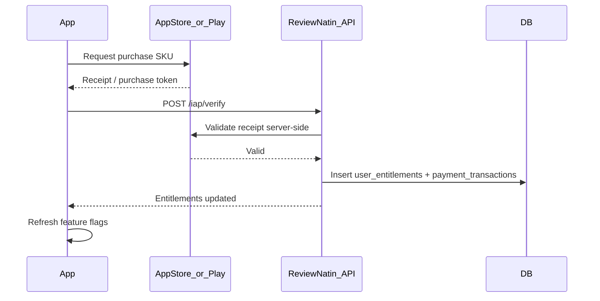

# Pricing and In-App Purchase (IAP) Specification

ReviewNatin Plus uses three subscription durations. Payments via **Apple App Store** and **Google Play Billing** first. GCash/Maya deferred to Phase 2 web checkout.

---

## Tier comparison

| Feature | Free | Plus Monthly | Plus 6 Months | Plus Yearly |
|---------|------|--------------|---------------|-------------|
| Price | ₱0 | **₱159/month** | **₱699/6 months** | **₱1,499/year** |
| Positioning | Starter free review | Starter access | Best value for one exam season | Long-term and multiple exam prep |
| Exams unlocked | 1 active (chosen at onboarding) | All Phase 1 exams | All Phase 1 exams | All Phase 1 exams |
| Practice quizzes | Daily free limit | Included | Included | Included |
| Mock exams | Limited / preview | Included | Included | Included |
| Flashcards | Included | Included | Included | Included |
| Diagnostic exams | Included | Included | Included | Included |
| Progress tracking | Basic | Included | Included | Included |
| PasaPath | Basic | Basic PasaPath copy | Full PasaPath copy | Full PasaPath copy |
| Offline review packs | No | Plus entitlement access | Highlighted | Highlighted |
| Weakness recommendations | Basic | Plus entitlement access | Highlighted | Highlighted |
| Priority question updates | Standard | Plus entitlement access | Highlighted | Highlighted |
| Ads | Banner (not during quiz/mock) | None | None | None |

**Savings display:**
- Plus 6 Months: ₱159 x 6 = ₱954 monthly equivalent; ₱699 price; save ₱255, shown as "Save around 27%".
- Plus Yearly: ₱159 x 12 = ₱1,908 monthly equivalent; ₱1,499 price; save ₱409, shown as "Save around 21%".

---

## SKU catalog

### Apple App Store

| SKU ID | Product type | Price tier (PHP) | Notes |
|--------|--------------|------------------|-------|
| `com.reviewnatin.plus.monthly` | Auto-renewable sub | ₱159 | Display order first |
| `com.reviewnatin.plus.six_months` | Auto-renewable sub | ₱699 | Display order second; BEST VALUE |
| `com.reviewnatin.plus.yearly` | Auto-renewable sub | ₱1,499 | Display order third |

### Google Play

| Product ID | Type | Price |
|------------|------|-------|
| `plus_monthly` | Subscription | ₱159 |
| `plus_six_months` | Subscription | ₱699 |
| `plus_yearly` | Subscription | ₱1,499 |

---

## Entitlement logic

```typescript
function hasAccess(userId: string, examTypeId: string, feature: Feature): boolean {
  const entitlements = await getActiveEntitlements(userId);

  if (entitlements.some(e => e.tier === 'plus' && !isExpired(e))) {
    return true; // Plus unlocks everything
  }

  return FREE_FEATURES.includes(feature);
}
```

### Plus subscription

- Monthly: 30-day rolling from renewal
- 6 Months: 180-day rolling from renewal
- Yearly: 365-day rolling
- Grace period: follow store policies (3–16 days)
- Restore purchases on new device required

---

## Paywall trigger points

| Trigger | Screen | Message |
|---------|--------|---------|
| Daily question limit hit | Practice Quiz | "You've used 20/20 free questions today. Unlock unlimited." |
| Full mock attempt | Mock Exam list | "Full mock requires ReviewNatin Plus." |
| Mistake older than 7 days | Mistake Bank | "Unlock full Mistake Bank history." |
| Offline download | Topic List | "Download reviewer pack for offline study." |
| Board Exam Mode | Practice mode picker | "Simulate real exam pressure with ReviewNatin Plus." |
| AI explanation limit | Result screen | "Daily AI explanations used. Upgrade for more." |

**Never show paywall:** During active mock timer, mid-question, or diagnostic.

---

## IAP implementation flow



### Server-side verification (required)

| Store | Endpoint | Library |
|-------|----------|---------|
| Apple | App Store Server API v2 | Verify JWS transaction |
| Google | Google Play Developer API | `purchases.subscriptions` / `products` |

**Never trust client-only receipt validation.**

### API: `POST /api/v1/iap/verify`

```json
{
  "platform": "apple",
  "product_id": "com.reviewnatin.exampass.cse_pro",
  "transaction_id": "...",
  "receipt_data": "..."
}
```

Response:

```json
{
  "success": true,
  "entitlements": [
    {
      "tier": "exam_pass",
      "exam_type_slug": "cse-professional",
      "expires_at": "2026-11-23T00:00:00+08:00"
    }
  ]
}
```

---

## Expo / React Native packages

| Package | Purpose |
|---------|---------|
| `expo-in-app-purchases` or `react-native-iap` | Store connection, purchase flow |
| RevenueCat (optional) | Cross-platform entitlement sync — reduces custom backend work |

**Recommendation:** RevenueCat for MVP speed if budget allows; otherwise `react-native-iap` + custom Supabase edge function for verification.

---

## Feature flags (client)

Store resolved entitlements in Zustand/Context on app launch and after purchase:

```typescript
type Entitlements = {
  tier: 'free' | 'exam_pass' | 'plus';
  unlockedExamSlugs: string[];
  expiresAt: Record<string, string>;
  dailyQuestionsRemaining: number;
  aiExplanationsRemaining: number;
};
```

Refresh on:
- App foreground
- Purchase complete
- `POST /iap/restore`

---

## Ads (free tier only)

| Placement | Allowed |
|-----------|---------|
| Dashboard bottom | Yes |
| Between practice sessions | Yes (interstitial max 1 per 30 min) |
| During practice question | **No** |
| During mock exam | **No** |
| Result screen | Banner only |

Use AdMob with child-directed settings off (17+ education app).

---

## Phase 2 monetization (not MVP)

| Model | Notes |
|-------|-------|
| GCash / Maya | Web checkout → manual entitlement grant or Xendit webhook |
| Review Center bulk | B2B invoice, seat licenses |
| School plan | Similar to bulk |
| Per-major LET unlock | ₱299 add-on if not on Plus |
| Sponsored materials | Carefully labeled, editorial review |

---

## Legal and store compliance

- Subscription terms: auto-renew disclosure before purchase (Apple requirement)
- Privacy policy: disclose payment data handling (RA 10173)
- Refunds: direct users to Apple/Google refund policies
- Pricing display: show PHP equivalent; store handles localized currency
- "Not affiliated with PRC/CSC" on subscription screen

---

## Analytics events

| Event | Properties |
|-------|------------|
| `paywall_viewed` | `trigger`, `exam_slug` |
| `purchase_started` | `sku`, `tier` |
| `purchase_completed` | `sku`, `revenue_php` |
| `purchase_failed` | `sku`, `error` |
| `restore_completed` | `entitlements_count` |

---

## Testing checklist

- [ ] Sandbox purchase each SKU (Apple Sandbox, Google test account)
- [ ] Restore purchases on second device
- [ ] Expired ReviewNatin Plus reverts to free limits
- [ ] Plus subscription renewal extends `expires_at`
- [ ] Subscription cancellation retains access until period end
- [ ] Receipt replay attack rejected server-side
