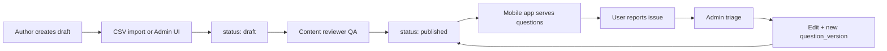

# Content Pipeline Specification

Content quality is the primary success factor. **Do not bulk-import questions before this pipeline is operational.**

---

## Pipeline overview



---

## Roles

| Role | Permissions |
|------|-------------|
| `content_author` | Create/edit drafts, cannot publish |
| `content_reviewer` | Approve/reject drafts, edit explanations |
| `admin` | Full access, resolve reports, manage blueprints |

Use `users.role` enum for MVP; separate `roles` table in Phase 2 if needed.

---

## Question authoring standards

### Required fields per question

| Field | Rule |
|-------|------|
| `topic_id` | Must map to active blueprint topic |
| `stem` | Clear, single problem, no trick wording |
| `choices` | Exactly 4 options (A–D), one correct |
| `correct_choice_id` | Double-checked by second reviewer for batches > 50 |
| `explanation_en` | Why correct + why others wrong (2–4 sentences) |
| `explanation_fil` | Taglish, student-friendly ("Explain Like Beginner") |
| `difficulty` | 1–5 calibrated |
| `source_note` | Required if adapted from PYQ or public material |
| `blueprint_id` | Locked at publish time |

### Verified badge criteria

Set `is_verified = true` only when:
- Reviewed by `content_reviewer` or `admin`
- Answer key confirmed against reference material or consensus of 2 reviewers
- Explanations present in EN and FIL
- No open `reported_questions` for this question

---

## CSV bulk import

### Template: `questions_import_v1.csv`

```csv
exam_type_slug,subject_slug,topic_slug,stem,choice_a,choice_b,choice_c,choice_d,correct_choice,difficulty,explanation_en,explanation_fil,source_note,tags
cse-professional,numerical,word-problems,"If 3 workers finish a job in 8 hours...",12,16,24,32,c,3,"Divide total work...","Kung 3 workers...","Original - ReviewNatin",numerical|word-problems
```

### Validation rules (import script)

| Rule | Error if violated |
|------|-------------------|
| `exam_type_slug` exists and `is_active` | Unknown exam |
| `topic_slug` exists under subject | Unknown topic |
| `correct_choice` in `a,b,c,d` | Invalid key |
| `stem` length 10–2000 chars | Too short/long |
| No duplicate `stem` hash in same topic | Duplicate |
| `difficulty` 1–5 | Out of range |
| `explanation_en` min 20 chars | Missing explanation |

### Import script behavior

1. Parse CSV → validate all rows
2. If errors > 0: return error report CSV, **import nothing**
3. Insert all as `status = draft`, `source = csv_import`
4. Log `admin_logs` entry with row count
5. Notify reviewers via admin queue count

**Location:** `scripts/import-questions.ts` (run from admin or CI)

### Admin UI import

Web admin: `/content/import`
- Upload CSV
- Preview first 10 rows
- Show validation errors inline
- Confirm import → draft queue

---

## Human review workflow

### Review queue (`/content/review`)

| Column | Sort default |
|--------|--------------|
| Topic | |
| Stem preview | |
| Author | |
| Import batch ID | |
| Created at | Oldest first |

### Reviewer actions

| Action | Result |
|--------|--------|
| Approve | `status → published`, set `reviewed_by`, `reviewed_at`, `is_verified = true` |
| Request edits | `status → draft`, comment to author |
| Reject | `status → archived`, reason required |

### Dual approval (recommended for batches > 100)

- Reviewer A approves → `status = in_review` (intermediate)
- Reviewer B approves → `status = published`

MVP shortcut: single reviewer if team < 3 people; document risk.

---

## User report flow (mobile)

### Entry points

- Result screen: **"Report wrong answer"** per question
- Settings: **"Report content issue"** (general)

### Report form

| Field | Type |
|-------|------|
| `reason` | Enum: Wrong answer, Unclear question, Outdated, Typo, Other |
| `details` | Optional text, max 500 chars |

### API: `POST /api/v1/reported-questions`

```json
{
  "question_id": "uuid",
  "reason": "wrong_answer",
  "details": "Choice B is also correct based on RA 6713 section 4."
}
```

### User feedback

- Toast: "Salamat! We'll review this within 48 hours."
- If question has 3+ open reports: auto-hide from new sessions (`status → in_review` via trigger)

---

## Admin triage (`/content/reports`)

| Status flow | Action |
|-------------|--------|
| `open` | Assign reviewer |
| `triaged` | Under investigation |
| `fixed` | Question edited, new `question_version`, reporter notified (optional email) |
| `rejected` | Report invalid, add internal note |

### SLA targets

| Priority | Response |
|----------|----------|
| Wrong answer key | Fix within 48 hours |
| Unclear wording | 5 business days |
| Outdated syllabus | Next blueprint version sprint |

---

## Question edit / versioning

When editing a **published** question:

1. Never mutate in place for users mid-session
2. Create `question_versions` snapshot of old state
3. Apply edits to `questions` row
4. Increment internal version counter
5. Published sessions retain old version reference via `quiz_answers.question_id` + version at answer time (add `question_version_id` to `quiz_answers` if legal dispute needed)

---

## Content changelog (user-visible)

Publish monthly via `content_changelog`:

```
March 2026 — LET Professional Education
• Added 120 new Prof Ed questions (PPST-aligned)
• Fixed 8 reported answer keys in Gen Ed Filipino
• Updated CSE General Information for 2026 cycle
```

Surface in app: Settings → "What's new" + optional dashboard chip.

---

## Blueprint alignment QA

Before publishing a batch:

- [ ] Every `topic_slug` exists in active `exam_blueprints.topic_weights`
- [ ] Batch size per topic proportional to weight ± 10%
- [ ] At least 50 published questions per topic before marking topic "complete" in admin
- [ ] 1 full mock exam worth of questions per exam type before public launch

### MVP content gates (launch blockers)

| Exam type | Min published questions | Min verified % |
|-----------|-------------------------|----------------|
| CSE Professional | 500 | 90% |
| CSE Subprofessional | 500 | 90% |
| LET Elementary | 800 | 85% |
| LET Secondary (2 majors) | 600 + 400/major | 85% |
| PNLE | 1500 | 85% |

---

## Offline content packs

### Pack structure

```
packs/pnle-v1.0.0.json
├── manifest (exam_type, version, question_count, checksum)
├── questions[] (embedded choices)
├── review_materials[]
└── flashcards[]
```

### Build pipeline

1. Export published questions for `exam_type_id` from DB
2. Sign manifest with checksum
3. Upload to Supabase Storage / CDN
4. App downloads on premium entitlement

**Regenerate packs** on each content changelog affecting that exam.

---

## AI-assisted content (guardrails)

| Use case | Allowed | Process |
|----------|---------|---------|
| Draft question generation | Yes | Always → `draft`, never auto-publish |
| Taglish explanation draft | Yes | Human reviewer edits before publish |
| AI answer verification | Assist only | Reviewer must confirm |

**Prohibited:** Auto-publish AI-generated questions without human review.

---

## PYQ and copyright

| Source | Policy |
|--------|--------|
| Official PRC/CSC past exams | Do not reproduce verbatim without license; use "PYQ-inspired" original items |
| Review center materials | No copying — original authoring only |
| Government publications (Constitution, RA texts) | Public domain facts OK; cite in `source_note` |

---

## Pre-launch content QA sprint (Week 11–12)

1. 3 subject-matter reviewers per exam (contracted teachers/nurses)
2. Each completes 50 random questions → log errors in spreadsheet
3. Target: < 1% error rate on answer keys
4. Fix all `reported_questions` from closed beta (50 users)
5. Publish changelog v1.0.0

---

## Admin API endpoints

| Method | Path | Role |
|--------|------|------|
| POST | `/admin/content/import` | content_author |
| GET | `/admin/content/review-queue` | content_reviewer |
| POST | `/admin/content/questions/:id/approve` | content_reviewer |
| GET | `/admin/content/reports` | admin |
| PATCH | `/admin/content/reports/:id` | admin |
| POST | `/admin/content/changelog` | admin |
| POST | `/admin/content/packs/build` | admin |

All `/admin/*` routes require JWT + role check. Separate from mobile user API.

---

## File checklist before bulk entry

- [ ] Active `exam_blueprints` row per exam type
- [ ] All `subject_areas` and `topics` seeded from [01-phase-1-exam-blueprints.md](./01-phase-1-exam-blueprints.md)
- [ ] CSV template distributed to authors
- [ ] Review queue staffed (min 2 reviewers)
- [ ] Report flow tested end-to-end on staging
- [ ] `content_changelog` table ready
